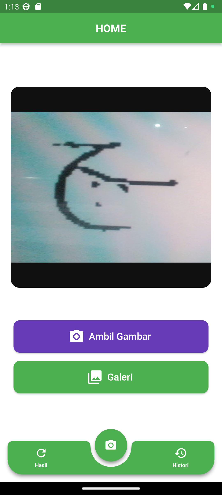
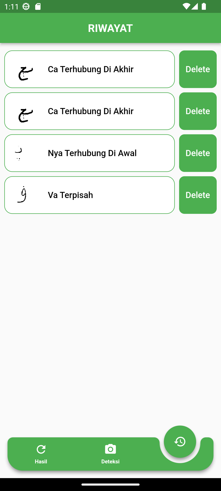
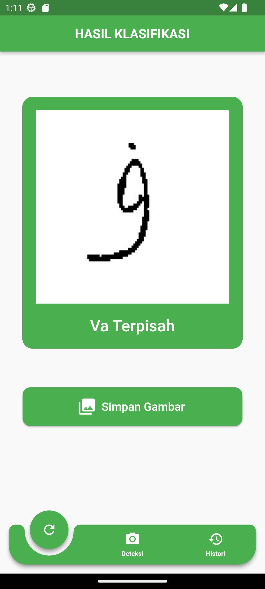

# Aplikasi Deteksi Huruf Jawi dengan MobileNetV2

Aplikasi Android yang dibuat dengan Flutter ini menggunakan model *deep learning* MobileNetV2 untuk mendeteksi dan mengklasifikasikan huruf-huruf Jawi secara *real-time* maupun melalui gambar dari galeri.

  

## 📜 Tentang Aplikasi

Aplikasi ini dirancang untuk memudahkan pengguna dalam mengenali berbagai bentuk huruf Jawi, termasuk bentuk tunggal (*terpisah*) maupun bentuk bersambung di awal, tengah, dan akhir kata. Dibangun untuk platform Android menggunakan framework **Flutter**, aplikasi ini memanfaatkan arsitektur MobileNetV2 yang ringan dan efisien, sehingga cocok untuk dijalankan pada perangkat *mobile*.

## ✨ Fitur-fitur

- **Deteksi Real-time:** Pengguna dapat langsung mengarahkan kamera ke tulisan Jawi untuk mendapatkan hasil klasifikasi secara langsung.
- **Deteksi dari Galeri:** Selain deteksi langsung, pengguna juga dapat memilih gambar yang sudah ada dari galeri untuk dianalisis.
- **Riwayat Deteksi:** Setiap hasil klasifikasi akan disimpan dalam menu riwayat, memungkinkan pengguna untuk melihat kembali hasil deteksi sebelumnya.
- **Antarmuka Sederhana:** Desain antarmuka yang bersih dan intuitif membuat aplikasi ini mudah digunakan oleh berbagai kalangan.

## 🧠 Teknologi yang Digunakan

### Flutter
Antarmuka pengguna aplikasi ini dibangun menggunakan Flutter, *UI toolkit* dari Google untuk membangun aplikasi *multi-platform* yang indah dan dapat dikompilasi secara *native* dari satu basis kode.

### Aksara Jawi
Aksara Jawi adalah sistem tulisan yang diadaptasi dari aksara Arab untuk menuliskan Bahasa Melayu. Aplikasi ini dapat mengenali huruf-huruf Jawi tambahan seperti 'Ca', 'Nga', 'Pa', 'Ga', dan 'Nya' dalam berbagai bentuknya.

### MobileNetV2
**MobileNetV2** adalah arsitektur *Convolutional Neural Network* (CNN) yang dioptimalkan untuk perangkat dengan sumber daya terbatas. Model untuk aplikasi ini melalui beberapa tahap. **Sebelumnya, ada proses *data science* untuk membersihkan dataset** dari data yang tidak relevan atau berkualitas buruk. Setelah dataset bersih, model secara spesifik **dilatih dan di-augmentasi** untuk meningkatkan akurasi dan ketahanannya dalam mengidentifikasi karakter Jawi dari berbagai sumber gambar. Dengan model yang telah terlatih ini, aplikasi dapat melakukan klasifikasi gambar dengan cepat dan akurat langsung di perangkat pengguna.

## 🚀 Cara Penggunaan

1.  **Buka Aplikasi:** Anda akan disambut dengan halaman utama.
2.  **Pilih Sumber Gambar:**
    * Pilih **"Ambil Gambar"** untuk menggunakan kamera.
    * Pilih **"Galeri"** untuk memilih gambar dari penyimpanan perangkat Anda.
3.  **Proses Klasifikasi:** Aplikasi akan memproses gambar untuk mendeteksi huruf Jawi.
4.  **Lihat Hasil:** Hasil klasifikasi akan ditampilkan di layar.
5.  **Simpan & Riwayat:** Hasil akan otomatis tersimpan di menu **"Riwayat"** untuk diakses kembali.

## 🔠 Daftar Huruf yang Dapat Dikenali

Berdasarkan file `labels.txt`, model ini dapat mengenali variasi dari huruf-huruf Jawi berikut:

-   Nya (Terpisah, Terhubung di Awal, Tengah, dan Akhir)
-   Nga (Terpisah, Terhubung di Awal, Tengah, dan Akhir)
-   Pa (Terpisah, Terhubung di Awal, Tengah, dan Akhir)
-   Ga (Terpisah, Terhubung di Awal, Tengah, dan Akhir)
-   Va (Terpisah dan Terhubung di Akhir)
-   Ca (Terpisah, Terhubung di Awal, Tengah, dan Akhir)

# Jawi Character Detection Application with MobileNetV2

This Android application, built with Flutter, uses the MobileNetV2 deep learning model to detect and classify Jawi characters in real-time and from gallery images.

  

## 📜 About the Application

This application is designed to help users recognize various forms of Jawi letters, including their isolated forms as well as their connected forms at the beginning, middle, and end of a word. Built for the Android platform using the **Flutter** framework, this app utilizes the lightweight and efficient MobileNetV2 architecture, making it suitable for running on mobile devices.

## ✨ Features

- **Real-time Detection:** Users can point their camera directly at Jawi script to get instant classification results.
- **Detection from Gallery:** In addition to live detection, users can also select existing images from their gallery for analysis.
- **Detection History:** Every classification result is saved in the history menu, allowing users to review previous detections.
- **Simple Interface:** A clean and intuitive user interface design makes the application easy to use for everyone.

## 🧠 Technology Used

### Flutter
The application's user interface is built using Flutter, Google's UI toolkit for building beautiful, natively compiled, multi-platform applications from a single codebase.

### Jawi Script
The Jawi script is a writing system adapted from the Arabic script for writing the Malay language. This application can recognize additional Jawi letters such as 'Ca', 'Nga', 'Pa', 'Ga', and 'Nya' in their various forms.

### MobileNetV2
**MobileNetV2** is a Convolutional Neural Network (CNN) architecture optimized for devices with limited resources. The model for this application went through several stages. **Previously, there was a data science process to clean the dataset** from irrelevant or poor-quality data. Once the dataset was clean, the model was specifically **trained and augmented** to improve its accuracy and robustness in identifying Jawi characters from various image sources. With this trained model, the application can perform fast and accurate image classification directly on the user's device.

## 🚀 How to Use

1.  **Open the Application:** You will be greeted by the main page.
2.  **Choose Image Source:**
    * Select **"Take a Picture"** to use the camera.
    * Select **"Gallery"** to choose an image from your device's storage.
3.  **Classification Process:** The application will process the image to detect Jawi characters.
4.  **View Results:** The classification results will be displayed on the screen.
5.  **Save & History:** The results will be automatically saved in the **"History"** menu for future access.

## 🔠 List of Recognizable Characters

Based on the `labels.txt` file, this model can recognize variations of the following Jawi letters:

-   Nya (Isolated, Initial, Medial, and Final)
-   Nga (Isolated, Initial, Medial, and Final)
-   Pa (Isolated, Initial, Medial, and Final)
-   Ga (Isolated, Initial, Medial, and Final)
-   Va (Isolated and Final)
-   Ca (Isolated, Initial, Medial, and Final)

