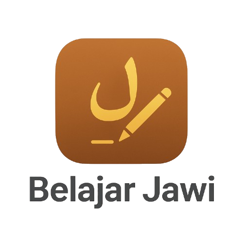

# BelajarJawi: Aplikasi Klasifikasi Huruf Jawi Berbasis AI

  

## 📖 1. Latar Belakang & Deskripsi Proyek

Aksara Jawi adalah warisan budaya tak ternilai di wilayah Nusantara. Upaya pelestariannya di era digital menghadapi tantangan besar akibat kelangkaan dataset yang komprehensif, sehingga menghambat kemajuan teknologi seperti *Optical Character Recognition* (OCR).

**BelajarJawi** lahir sebagai implementasi praktis dari penelitian yang saya dan tim publikasikan, berjudul **["Augmentation of Additional Arabic Dataset for Jawi Writing and Classification Using Deep Learning"](https://garuda.kemdikbud.go.id/documents/detail/4167953)**. Penelitian kami berhasil menciptakan dataset baru dan membuktikan efektivitas model *deep learning* untuk klasifikasi aksara Jawi. Dengan "otak" berupa model AI yang canggih, aplikasi ini berfungsi sebagai jembatan antara warisan budaya dan teknologi modern, menjadikannya alat yang relevan untuk edukasi dan pelestarian.

---

## 🧠 2. Inti Teknologi: Kekuatan Deep Learning

Keunggulan utama aplikasi ini terletak pada implementasi model *deep learning* yang dilatih berdasarkan metodologi dari penelitian yang saya dan tim publikasikan.

### A. Solusi untuk Kelangkaan Data
Masalah utama dalam pengenalan aksara Jawi adalah dataset yang sangat terbatas. Penelitian kami menawarkan solusi inovatif dengan melakukan **augmentasi dataset**. Caranya adalah dengan memanfaatkan dataset aksara Arab dan Urdu yang sudah ada (HMBD, AHAWP, dan HUCD), kemudian secara cerdas memodifikasinya untuk menciptakan 6 karakter Jawi tambahan dalam 22 bentuk tulisan yang berbeda.

### B. Validasi Performa dengan Akurasi Tinggi
Efektivitas dataset hasil augmentasi ini kami validasi dengan melatih dua arsitektur *deep learning* terkemuka:
* **InceptionV3:** Mencapai akurasi **95%**.
* **ResNet34:** Menunjukkan performa terbaik dengan akurasi **96%**.

Keberhasilan ini membuktikan secara ilmiah bahwa model *deep learning* mampu mengenali karakter Jawi dengan sangat akurat dan konsisten.

### C. Implementasi pada Aplikasi
Berbekal validasi tersebut, aplikasi **BelajarJawi** mengimplementasikan model **EfficientNet-B0**, sebuah arsitektur *state-of-the-art* yang terkenal sangat efisien dan akurat, menjadikannya pilihan ideal untuk inferensi cepat langsung di perangkat pengguna (*on-device*).

---

## ✨ 3. Fitur Utama

-   **Klasifikasi Real-time:** Deteksi huruf Jawi secara instan dari gambar.
-   **Akurasi Tinggi:** Ditenagai oleh model *Deep Learning* yang dilatih berdasarkan metodologi riset yang terbukti mencapai akurasi hingga 96%.
-   **Pembelajaran Interaktif:** Hasil deteksi disertai penjelasan informatif mengenai huruf.
-   **Riwayat Deteksi:** Menyimpan semua hasil klasifikasi untuk ditinjau kembali.
-   **UI Modern & Intuitif:** Antarmuka yang bersih dan mudah digunakan.

---

## 🚀 4. Teknologi & Arsitektur

-   **Framework:** Flutter
-   **Bahasa:** Dart
-   **Deep Learning (On-Device AI):**
    -   **Model:** `EfficientNet-B0` dengan strategi AutoAugment.
    -   **Runtime:** ONNX Runtime (`flutter_onnxruntime`) untuk inferensi *on-device* yang cepat.
-   **Database Lokal:** `sqflite`
-   **Manajemen State:** `MainNavigator`
-   **UI/UX & Utilitas:** `animated_notch_bottom_bar`, `FutureBuilder`, `image_picker`, `intl`, `image`.

---

## 💡 5. Tantangan & Pembelajaran

-   **Integrasi Model AI:** Memastikan model ONNX berjalan efisien di lingkungan Flutter.
-   **Akurasi pada Kasus Sulit:** Menangani kemiripan visual antar karakter Jawi, terutama dalam bentuk sambung, yang diidentifikasi dalam penelitian sebagai tantangan utama.
-   **Manajemen State & UI Responsif:** Mengelola state antar halaman dan memastikan layout fungsional di berbagai ukuran layar.

---

## 📸 6. Galeri Aplikasi

| Demo Aplikasi | Halaman Deteksi | Halaman Hasil | Halaman Riwayat |
| :---: | :---: | :---: | :---: |
|  |  |  |  | 

---

## ⚖️ 7. Lisensi & Ketersediaan Model

-   **Kode Sumber:** Proyek ini dilisensikan di bawah **Lisensi MIT**.
-   **Model AI:** Model klasifikasi yang telah dilatih adalah **aset pribadi (proprietary)** hasil dari penelitian akademis oleh saya dan tim, sehingga **tidak disertakan** dalam repositori ini.

### Cara Menjalankan Proyek
Untuk menjalankan aplikasi ini, Anda perlu menyediakan file model ONNX Anda sendiri.
1.  Latih model klasifikasi gambar Anda.
2.  Ekspor model ke format `.onnx`.
3.  Letakkan file model di direktori `assets/models/` dan perbarui `assetPath` di `home_screen.dart`.
4.  Pastikan Anda telah menambahkan `assets/models/` ke dalam file `pubspec.yaml`.
